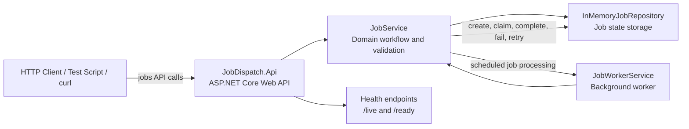
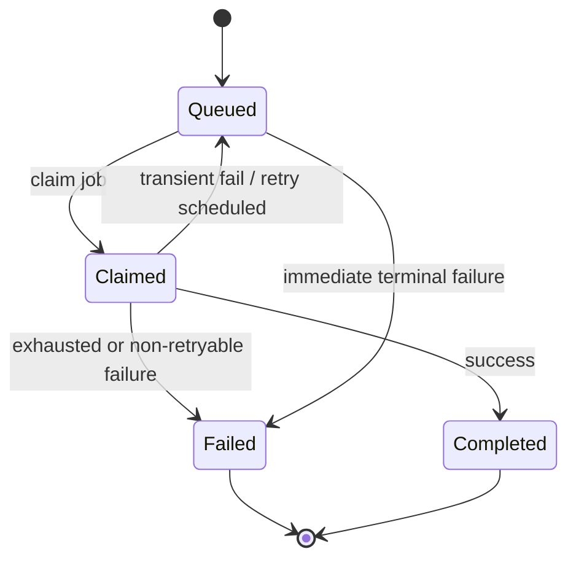
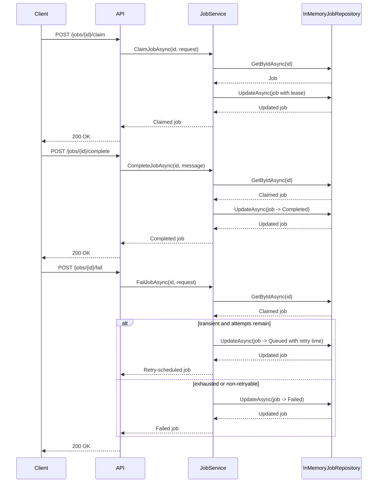

# Job Dispatch .NET baseline

This project is the reference .NET implementation for the migration to Go. It exposes a small job-dispatch API with create, read, claim, complete, fail, and health endpoints.

## Architecture



This baseline is intentionally small but representative of the presentation scope: a web API, a deterministic in-memory job repository, background polling, and state transitions for queued, claimed, completed, and failed jobs.

## Job state machine



## Request flow: claim, complete, and fail



## Run locally

```bash
dotnet run --project .\src\JobDispatch.Api\JobDispatch.Api.csproj --urls http://localhost:5123
```

The project also includes a launch profile in `Properties/launchSettings.json`, which targets `http://localhost:5123` by default.

## Manual API usage

### 1) Health checks

```bash
curl http://localhost:5123/health/live
curl http://localhost:5123/health/ready
```

Example response:

```json
{ "status": "live", "timestamp": "2026-09-01T12:00:00Z" }
```

### 2) Create a job

```bash
curl -X POST http://localhost:5123/jobs \
  -H "Content-Type: application/json" \
  -d '{
    "jobType": "email",
    "name": "welcome-email",
    "payload": { "to": "user@example.com", "template": "welcome" },
    "maxAttempts": 3
  }'
```

Example response:

```json
{
  "id": "d33fd0bd-1fa2-4f0f-9d13-0c27d8a4e89f",
  "jobType": "email",
  "name": "welcome-email",
  "status": "queued",
  "attemptCount": 0,
  "maxAttempts": 3,
  "createdAt": "2026-09-01T12:00:00Z",
  "updatedAt": "2026-09-01T12:00:00Z",
  "nextAttemptAt": "2026-09-01T12:00:00Z"
}
```

### 3) Read a job

```bash
curl http://localhost:5123/jobs/<job-id>
```

### 4) Claim a queued job

```bash
curl -X POST http://localhost:5123/jobs/<job-id>/claim \
  -H "Content-Type: application/json" \
  -d '{
    "workerId": "worker-1",
    "leaseOwner": "worker-1",
    "leaseSeconds": 60
  }'
```

If the job is in a valid state, the response returns the updated job with `status: "claimed"` and a lease expiry time.

### 5) Complete a claimed job

```bash
curl -X POST http://localhost:5123/jobs/<job-id>/complete \
  -H "Content-Type: application/json" \
  -d '{
    "message": "email sent successfully"
  }'
```

### 6) Fail a claimed job

```bash
curl -X POST http://localhost:5123/jobs/<job-id>/fail \
  -H "Content-Type: application/json" \
  -d '{
    "error": "SMTP timeout",
    "transient": true,
    "retryable": true
  }'
```

This schedules a retry if the job still has remaining attempts; otherwise it transitions to a terminal `failed` state.

## Worker behavior

The background worker is disabled by default. To enable it, set:

```bash
setx JobDispatch__WorkerEnabled true
```

Or use environment variables when starting the process:

```bash
$env:JobDispatch__WorkerEnabled = "true"
dotnet run --project .\src\JobDispatch.Api\JobDispatch.Api.csproj --urls http://localhost:5123
```

The worker polls for eligible jobs, claims them, and then either completes or fails them according to the service logic.

Queued jobs are eligible only when `nextAttemptAt` is due. Claimed jobs whose lease has expired are also eligible, allowing the worker to recover abandoned in-memory work. The optional `leaseSeconds` claim field overrides the configured lease duration for that claim; when omitted, `JobDispatch:LeaseDuration` is used.

The frozen presentation contract is documented in [CONTRACT_FREEZE.md](CONTRACT_FREEZE.md).

## API contract summary

- `POST /jobs` creates a queued job
- `GET /jobs/{id}` reads a job by id
- `POST /jobs/{id}/claim` claims a queued or expired job for processing with a lease
- `POST /jobs/{id}/complete` completes a claimed job
- `POST /jobs/{id}/fail` marks a claimed job failed or schedules retry
- `GET /health/live` liveness endpoint
- `GET /health/ready` readiness endpoint

## Notes

- The request model accepts the canonical `jobType` and `maxAttempts` payload shape, and also supports compatibility aliases used by the service layer.
- Retry logic is bounded and deterministic: transient failures retry until `maxAttempts` is exhausted.
- Errors return consistent payloads with a code and message, and invalid state transitions produce `4xx` responses.
- Startup validates the `JobDispatch` options section and rejects invalid durations or attempt limits.

## CONSIDERATIONS BEYOND PROJECT SCOPE:

This reference implementation intentionally does not provide the broader production features that may be discussed in the presentation:

- PostgreSQL persistence, schema migrations, and database-backed readiness.
- Transactional concurrent claiming and lease-recovery integration tests.
- Metrics, distributed tracing, and extensive correlation infrastructure.
- Docker, Docker Compose, non-root packaging, and image comparisons.
- Authentication, external queues, Kubernetes, load testing, and exactly-once processing.
