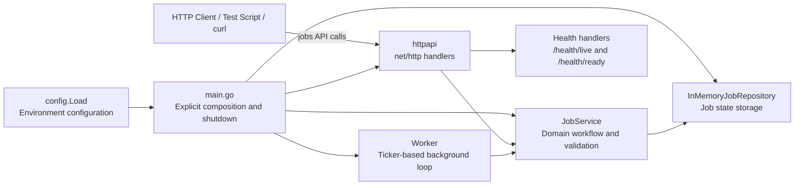
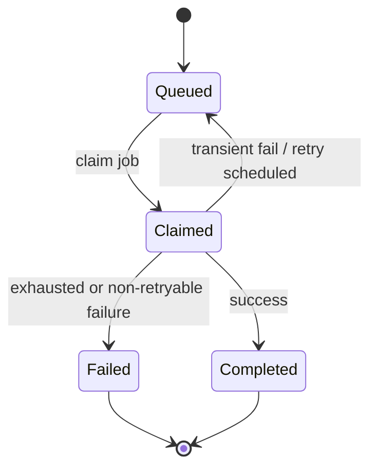
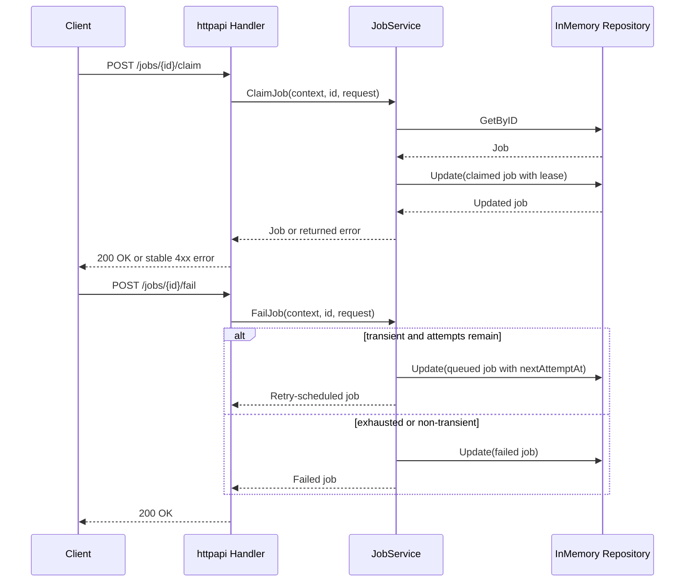

# Job Dispatch Go port

This project is the presentation-focused Go port of the .NET Job Dispatch API. It preserves the frozen lifecycle, retry, lease, worker, health, and error contracts documented in [`.NetProject/CONTRACT_FREEZE.md`](../.NetProject/CONTRACT_FREEZE.md).

The port intentionally uses only the Go standard library. Its main purpose is to show the Go equivalents of ASP.NET Core composition, exception handling, `BackgroundService`, and `CancellationToken`.

## Architecture



The .NET dependency-injection container is replaced by explicit construction in [`cmd/jobdispatch/main.go`](cmd/jobdispatch/main.go): `main` creates the repository, service, HTTP handler, and worker, then connects them to the server lifecycle.

## Job state machine



Queued jobs are eligible only when `nextAttemptAt` is due. A claimed job with an expired lease is eligible for recovery. The in-memory repository protects map access with `sync.RWMutex`, but claim is not a transactional compare-and-swap operation; database-backed multi-worker claiming remains outside this scope.

## Request flow: claim, complete, and fail



## Run locally

From the `GoProject` directory:

```powershell
go run .\cmd\jobdispatch
```

The server listens on `:8080` by default. Stop it with `Ctrl+C`; `main` cancels the worker context and uses `http.Server.Shutdown` with a five-second timeout.

## Manual API usage

### 1) Health checks

```powershell
curl.exe http://localhost:8080/health/live
curl.exe http://localhost:8080/health/ready
```

Example response:

```json
{ "status": "live", "timestamp": "2026-09-02T20:00:00Z" }
```

### 2) Create a job

```powershell
curl.exe -X POST http://localhost:8080/jobs `
  -H "Content-Type: application/json" `
  -d '{"jobType":"email","name":"welcome-email","payload":{"to":"user@example.com","template":"welcome"},"maxAttempts":3}'
```

The response is a queued job with an ID, timestamps, `attemptCount: 0`, and `nextAttemptAt`.

### 3) Read a job

```powershell
curl.exe http://localhost:8080/jobs/<job-id>
```

### 4) Claim a queued job

```powershell
curl.exe -X POST http://localhost:8080/jobs/<job-id>/claim `
  -H "Content-Type: application/json" `
  -d '{"leaseOwner":"worker-1","leaseSeconds":60}'
```

### 5) Complete a claimed job

```powershell
curl.exe -X POST http://localhost:8080/jobs/<job-id>/complete `
  -H "Content-Type: application/json" `
  -d '{"message":"email sent successfully"}'
```

### 6) Fail a claimed job

```powershell
curl.exe -X POST http://localhost:8080/jobs/<job-id>/fail `
  -H "Content-Type: application/json" `
  -d '{"error":"SMTP timeout","transient":true}'
```

A transient failure queues a retry while attempts remain; otherwise the job becomes terminally failed.

## Configuration

Configuration is loaded explicitly from environment variables by [`internal/config/config.go`](internal/config/config.go), rather than through the ASP.NET configuration provider pipeline.

| Environment variable | Default | Meaning |
|---|---:|---|
| `JOBDISPATCH_ADDR` | `:8080` | HTTP listen address |
| `JobDispatch__DefaultMaxAttempts` | `3` | Attempts used when the request omits `maxAttempts` |
| `JobDispatch__LeaseDuration` | `5m` | Default claim lease |
| `JobDispatch__RetryBackoff` | `30s` | Delay before a transient retry becomes eligible |
| `JobDispatch__WorkerPollInterval` | `15m` | Background polling interval |
| `JobDispatch__WorkerEnabled` | `false` | Enables the background worker |

Durations use Go duration syntax, such as `30s`, `5m`, and `1h`. The loader also accepts the .NET-style `hh:mm:ss` form. Invalid values stop startup and are logged as configuration errors.

## Worker behavior

The worker is disabled by default so API demonstrations remain deterministic. Enable it for the current PowerShell session:

```powershell
$env:JobDispatch__WorkerEnabled = "true"
$env:JobDispatch__WorkerPollInterval = "1s"
go run .\cmd\jobdispatch
```

[`internal/worker/worker.go`](internal/worker/worker.go) maps the .NET `BackgroundService` pattern to an explicit Go `Run` method:

- `time.Ticker` provides polling.
- `context.Context` replaces `CancellationToken`.
- `select` waits for a polling tick or cancellation.
- `go jobWorker.Run(workerCtx)` starts the worker goroutine.
- Expected job errors are logged without terminating the worker.

For the deterministic demo behavior, job type or name containing `retry` schedules a transient retry, and one containing `fail` follows the same retry path until attempts are exhausted.

## Tests and smoke test

Run all Go tests:

```powershell
go test ./...
```

Run the external process smoke test:

```powershell
.\scripts\smoke-test.ps1
```

The smoke test builds the executable, starts it on a temporary local port, waits for readiness, executes create -> claim -> complete, stops only the child process it created, and removes the temporary executable.

## API contract summary

- `POST /jobs` creates a queued job.
- `GET /jobs/{id}` reads a job by ID.
- `POST /jobs/{id}/claim` claims a queued or expired job with a lease.
- `POST /jobs/{id}/complete` completes a claimed job.
- `POST /jobs/{id}/fail` schedules retry or records terminal failure.
- `GET /health/live` is the liveness endpoint.
- `GET /health/ready` is the readiness endpoint.

Errors use `{ "code": "...", "message": "..." }`. The stable codes are `VALIDATION_ERROR`, `JOB_NOT_FOUND`, and `INVALID_JOB_STATE`.

## .NET-to-Go presentation takeaways

| .NET reference | Go port |
|---|---|
| ASP.NET Core service registration | Explicit object construction in `main.go` |
| `JobDispatchException` hierarchy | Returned errors classified with `errors.Is` |
| `BackgroundService` and `CancellationToken` | Goroutine, `time.Ticker`, `context.Context`, and `select` |
| Configuration binding and options validation | Environment parsing and validation in `config.Load` |
| `WebApplicationFactory` tests | Standard-library `httptest` plus a PowerShell process smoke test |

## Considerations beyond project scope

This presentation-focused port intentionally excludes:

- PostgreSQL persistence, migrations, and database-backed readiness
- Transactional multi-worker claiming and distributed lease recovery
- Metrics, tracing, correlation middleware, and alerting
- Docker, Docker Compose, and image comparisons
- Authentication, external queues, Kubernetes, load testing, and exactly-once processing
